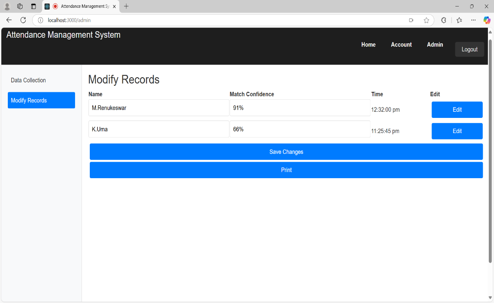
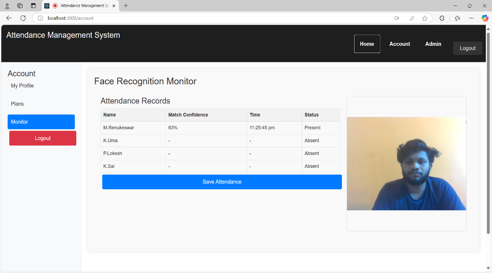
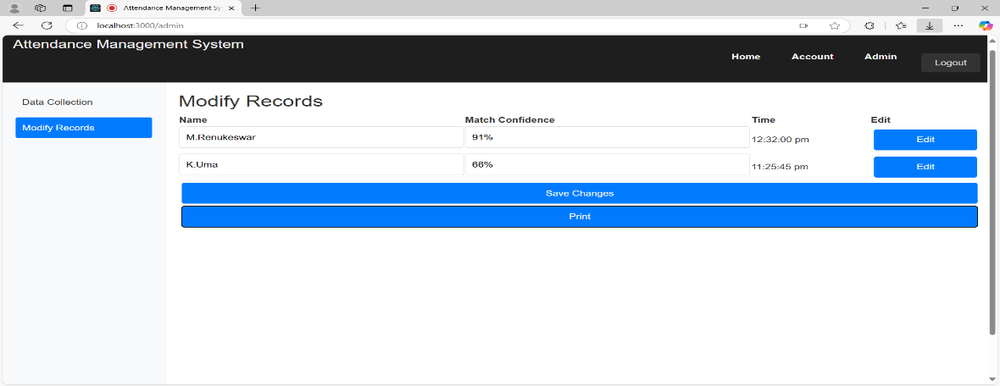
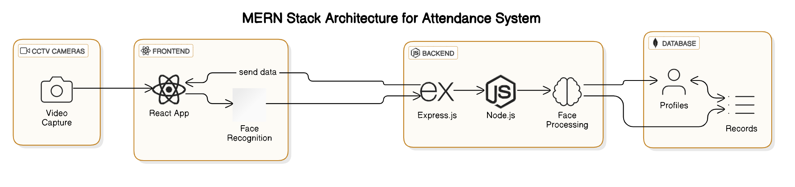
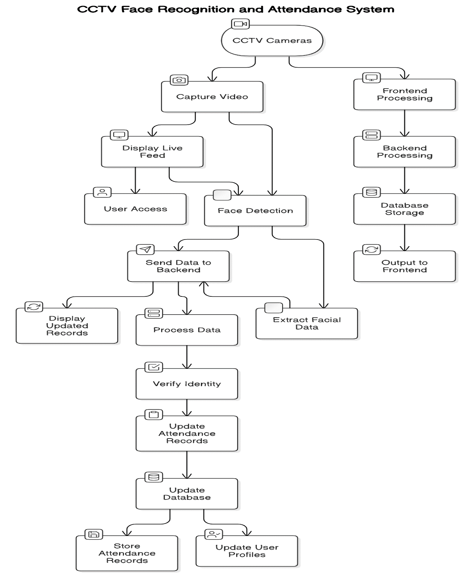

# 🎓 Automated Attendance Management System Using Face Recognition


> A smart, contactless, AI-powered attendance management system built using the MERN stack and facial recognition technology.

---

# 📌 Project Overview

Traditional attendance systems such as:

- Paper registers
- RFID cards
- Barcode scanners
- Fingerprint systems

suffer from several problems:

❌ Manual errors  
❌ Proxy attendance  
❌ Hardware dependency  
❌ Hygiene concerns  
❌ Time consumption  
❌ Maintenance costs  

This project solves these issues by integrating:

✅ Real-time facial recognition  
✅ MERN stack web application  
✅ CCTV/Webcam live feed processing  
✅ Automated attendance logging  
✅ Secure and scalable architecture  

The system uses deep learning-based face recognition techniques for accurate and real-time identification.

---

# 🖼️ Project Preview

## Dashboard UI



---

## Real-Time Face Recognition



---

## Attendance Monitoring



---

## MERN Stack Architecture



---

## System Flowchart



---

# 🚀 Features

- ✅ Real-time face detection and recognition
- ✅ Automated attendance marking
- ✅ Proxy attendance prevention
- ✅ Contactless attendance system
- ✅ MERN stack architecture
- ✅ Responsive React dashboard
- ✅ Attendance records management
- ✅ Live camera feed integration
- ✅ Secure MongoDB storage
- ✅ Fast processing with minimal delay
- ✅ Scalable and efficient system

---

# 🛠️ Tech Stack

## Frontend

| Technology | Usage |
|------------|-------|
| React.js | Frontend UI |
| HTML5 | Structure |
| CSS3 | Styling |
| JavaScript | Functionality |

---

## Backend

| Technology | Usage |
|------------|-------|
| Node.js | Runtime |
| Express.js | Backend Framework |

---

## Database

| Technology | Usage |
|------------|-------|
| MongoDB | Database |

---

## Face Recognition

| Technology | Usage |
|------------|-------|
| face-api.js | Face Recognition |
| MTCNN | Face Detection |
| ResNet-34 | Feature Extraction |

---

# 📂 Project Structure

```bash
Automated-Attendance-System/
│
├── client/                 # React Frontend
│   ├── src/
│   ├── public/
│   └── package.json
│
├── server/                 # Node.js Backend
│   ├── models/
│   ├── routes/
│   ├── controllers/
│   ├── middleware/
│   └── server.js
│
├── database/               # MongoDB Configurations
│
├── face-recognition/       # Face Recognition Logic
│
├── assets/                 # Images and UI Assets
│
├── README.md
└── package.json
```

---

# ⚙️ System Architecture

## 🔹 Frontend (React.js)

- User dashboard
- Live camera feed
- Attendance records
- Real-time updates

---

## 🔹 Backend (Node.js + Express.js)

- API handling
- Authentication
- Attendance processing
- Business logic

---

## 🔹 Database (MongoDB)

- User profiles
- Facial descriptors
- Attendance logs

---

## 🔹 Face Recognition Module

- Face detection using MTCNN
- Feature extraction using ResNet-34
- Real-time face matching

---

# 🧠 System Workflow

```text
Camera Feed
     ↓
Face Detection
     ↓
Feature Extraction
     ↓
Face Matching
     ↓
Attendance Recording
     ↓
Database Storage
     ↓
Dashboard Update
```

---

# 📊 Performance Results

## ✅ Face Recognition Accuracy

- Accuracy achieved:
  
# 95%

### Performance Graph


---

## ⚡ System Efficiency

- 100 users processed in under 5 minutes
- Attendance update delay less than 2 seconds

---

## ⏱️ Real-Time Processing


---

# 💻 User Interface

## Login Page


---

## Dashboard


---

## Attendance Records


---

# 🔒 Advantages

✅ Eliminates manual errors  
✅ Prevents proxy attendance  
✅ Contactless and hygienic  
✅ Faster attendance processing  
✅ Reduces administrative workload  
✅ Scalable architecture  
✅ Secure data storage  

---

# ⚠️ Challenges

- Low-light recognition issues
- Facial angle variations
- Large-scale dataset optimization
- Camera positioning dependency

---

# 🔮 Future Enhancements

- 📱 Mobile application support
- ☁️ Cloud deployment
- 🔐 Advanced biometric encryption
- 🤖 AI analytics dashboard
- 🎥 Multi-camera synchronization
- 🌙 Improved low-light detection

---

# 🧪 Installation Guide

## 📌 Prerequisites

Install the following before starting:

- Node.js
- MongoDB
- npm/yarn

---

# 📥 Clone Repository

```bash
git clone https://github.com/your-username/attendance-management-system.git
cd attendance-management-system
```

---

# 📦 Install Dependencies

## Backend

```bash
cd server
npm install
```

## Frontend

```bash
cd client
npm install
```

---

# ⚙️ Environment Variables

Create a `.env` file inside the server directory:

```env
PORT=5000
MONGO_URI=your_mongodb_connection_string
JWT_SECRET=your_secret_key
```

---

# ▶️ Run Backend

```bash
npm start
```

---

# ▶️ Run Frontend

```bash
npm start
```

---

# 📈 Future Scalability

The system architecture is designed for:

- Large organizations
- Universities
- Schools
- Corporate offices
- Cloud scalability
- Real-time analytics

---

# 👨‍💻 Authors

| Name |
|------|
| Medisetti Renukeswar |
| Mr. Koppala Mohan Rao |
| Kota Sai Kumar |
| Pakkurti Lokesh |
| Kotipalli Uma |

---

# 📚 Research Concepts Used

- Face Recognition
- Deep Learning
- CNN Models
- MTCNN
- ResNet-34
- MERN Stack
- Real-Time Processing
- Biometric Authentication

---

# 📄 License

This project is developed for:

- Educational purposes
- Research purposes
- Learning and experimentation

---

# ⭐ Conclusion

The Automated Attendance Management System using Face Recognition demonstrates how AI and modern web technologies can replace outdated attendance systems with a smarter, faster, and more secure solution.

By combining:

- Face Recognition
- MERN Stack
- Real-Time Processing
- Contactless Authentication

the system achieves:

✅ High accuracy  
✅ Improved efficiency  
✅ Better scalability  
✅ Reduced fraud  
✅ Enhanced user experience  

This project is a strong real-world implementation of AI-powered automation in educational and organizational environments.

---
